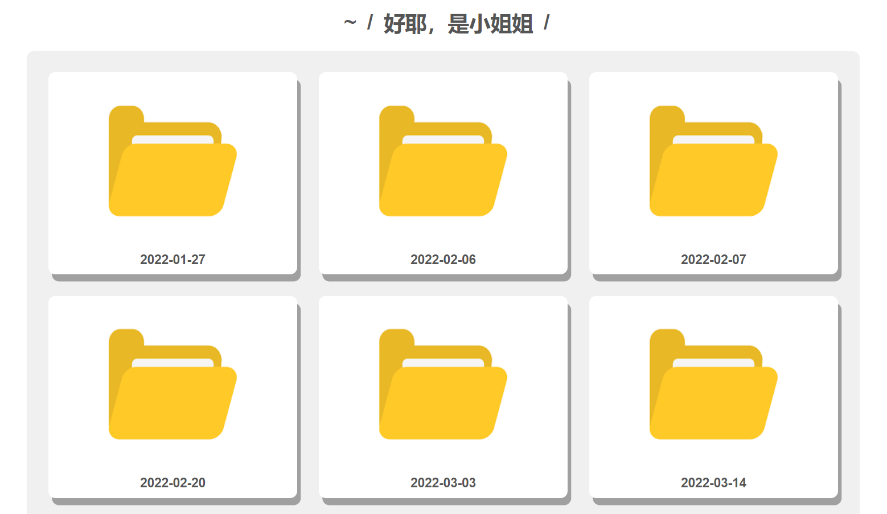
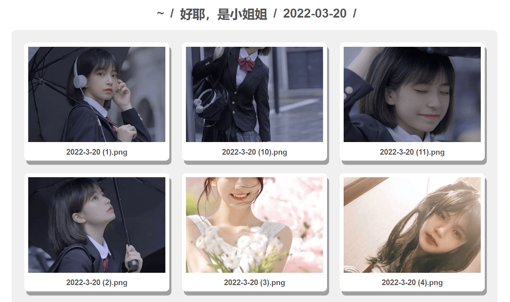

<h1>私人小相册  </h1>

## 1. 说明

其实吧，本来这个项目是肩负着非常伟大的项目的，不过那个项目的一部跟胎死腹中了，所以我现在就把这个项目独立出来，做成一个私人相册的项目。

啊，是的，你也看到了，都是小姐姐，我也很喜欢这个项目（￣︶￣）↗　。

其实这些照片都是我的一个好基友的，上学期非常喜欢给我分享小姐姐，我也认为这些照片质量很高，这不，拿出来分享出来给大家。他知道我喜欢短头发的小姐姐，所以短头发小姐姐也挺多的。

这个项目一部分是基于我前面做过的文件服务器的项目，感兴趣的可以去看看。

- https://github.com/MR-Addict/ghpages-fileserver

## 2. 预览

文件夹界面



相册界面



预览界面


## 3. 如何部署

第一步，克隆本文档：

```bash
git clone https://github.com/MR-Addict/image-gallery.git
```

第二步：安装依赖

```bash
pip install -r requirements.txt
```

第三步：生成文件

将你需要制作成相册的照片放到`src`文件夹下，运行python脚本之后会生成一个`public`文件夹

```bash
python main.py
```

第四步：搭建web服务器

如果你有node可以运行这条命令：

```bash
node index.js
```

没有node可以使用python：

```bash
python -m http.server 8085 --directory public
```

> Demo网址
> - [https://mr-addict.github.io/image-gallery](https://mr-addict.github.io/image-gallery)

## 4. 如何参与

你也想分享你的优质图片?

熟悉`Pull request`的直接按照Pull request的步骤来就可以了。

PR成功后GitHub Action会自动部署到本项目的Pages上哦。

## 5. 结束

Happy coding!
